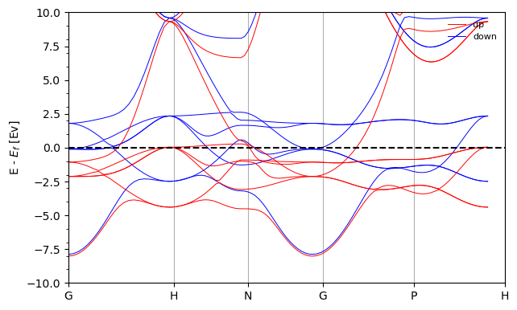

<!-- ABOUT THE PROJECT -->
## About The Project

This tool is designed to help you analyze and visualize the results obtained from Quantum Espresso simulations (Band structure, density of states DOS, pDOS). It simplifies the process of interpreting complex data, remaining accessibly simple to adjust the code for your needs. 

Features:
* *Visualization*: Generate clear and informative visualizations to better understand your simulation results.
* *Ready-to-use visualization methods*: Simple and intuitive interface for efficient workflow.
* Wannier90 hamiltonian loading and BS plotting

There are only 2 files to examine!!! and the idea is to modify them for your personal needs fast. 
Use `example` to get started.

<p align="right">(<a href="#readme-top">back to top</a>)</p>


### Prerequisites

* qeschema
  ```sh
  pip install qeschema
  ```

<!-- USAGE EXAMPLES -->
## Usage

Define you data document using:
```python
import qe_BS_DOS
calc = qe_BS_DOS.VASP_analyse_spinpolarized_3D('./', 'Fe')
```
Now you can access basic plots and properties
```python
calc.get_qe_kpathBS()
calc.plot_FullDOS()
calc.plot_BS()
  ```





<!-- CONTACT -->
## Contact

Egor Agapov -  agapov.em@phystech.edu
Project Link: [https://github.com/EgorcaA/qe_helper](https://github.com/EgorcaA/qe_helper)
<p align="right">(<a href="#readme-top">back to top</a>)</p>

