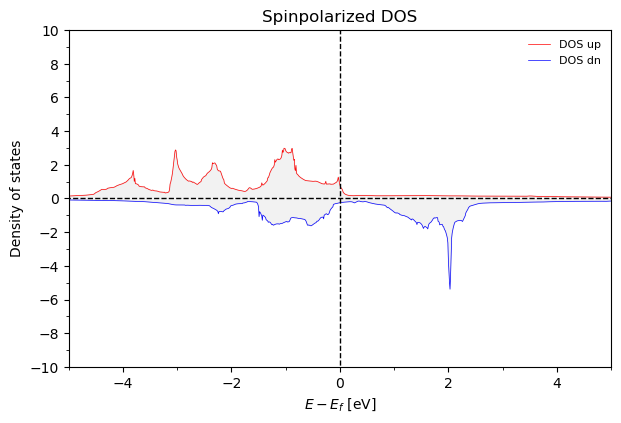

<!-- ABOUT THE PROJECT -->
## About The Project

This tool is designed to help you analyze and visualize the results obtained from Quantum Espresso simulations. It simplifies the process of interpreting complex data, remaining accessibly simple to adjust the code for your needs. 

Features:
* *Comprehensive Analysis*: Perform in-depth analysis of Quantum Espresso output files with ease.
* *Visualization*: Generate clear and informative visualizations to better understand your simulation results.
* *Ready-to-use visualization methods*: Simple and intuitive interface for efficient workflow.

Use `example` to get started.

<p align="right">(<a href="#readme-top">back to top</a>)</p>


<!-- GETTING STARTED -->
## Getting Started

This is an example of how you may give instructions on setting up your project locally.
To get a local copy up and running follow these simple example steps.

### Prerequisites

* qeschema
  ```sh
  pip install qeschema
  ```

<!-- USAGE EXAMPLES -->
## Usage

Define you data document using:
```python
  import qe_BS_DOS
calc = qe_BS_DOS.VASP_analyse_spinpolarized_3D('./', 'Fe')
```
Now you can access basic plots and properties
```python
calc.get_qe_kpathBS()
calc.plot_FullDOS()
calc.plot_BS()
  ```




<!-- CONTACT -->
## Contact

Egor Agapov -  agapov.em@phystech.edu

Project Link: [https://github.com/your_username/repo_name](https://github.com/your_username/repo_name)

<p align="right">(<a href="#readme-top">back to top</a>)</p>

